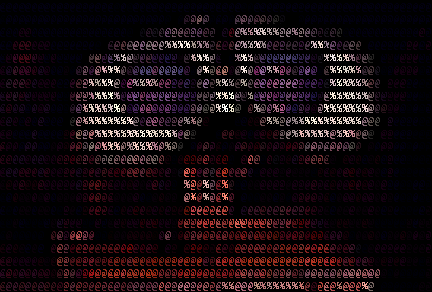

## _Mars Rover Kata_
Program to simulate rovers movement around the surface of Mars

 Thanks to https://github.com/ianmartinez/AsciiStudio for this image 


To start the simulation run the App/Main.java class running the Main class, some test cases are already available,
using number 1-5  you can see in the console output where they move.

✨***TEST CASES FROM MAIN APP***
```sh
1- Simulate 2 rovers moving, no errors
2- contains invalid commands
3- cointains invalid commands that send the rover out of the plateau
4- shows the behaviour of the rover when it meets an obstacle on its way
5- shows the behaviour of the program when the starting point is not valid
6- you can personalize *custom file*!  copy/paste your tests in the file autotest/custom.txt 
  
```
✨***CUSTOM COMMAND FILE FORMAT***
```sh
1st line: 2 integer numbers separated by a space
 they set the max x y coordinates of the plateau, where rovers are allowed to move
2nd line: 2 integer numbers and a letter [N-S-E-W] separated by a space
 the coordinates of a rover on the plateau and the direction the rover is facing
3d line: sequence of letters [RLM] without spaces between them 
 R rotates the rover RIGHT 
 L rotates the rover LEFT
 M moves the rover 1 grid space 
```
✨
it's possible to move several rovers in sequence, you can add them repeating 2nd and 3rd lines format for each rover.
save your file in the main directory and choose option 6 when running App/Main.java

✨***ASSUMPTIONS***
```sh
the plateau shape is rectangular/square
the rovers wont move out the plateau, they will give their last position and ignore further commands
if a rover encounters another rover it will stop and give the last position and an error message
if a rover is supposed to start from a point where another rover is standing, it will move to a next available point,
 give the point coordinates and wont move further
```
✨***possible further implementation:***
```sh
-save rovers position in an text file
-load a graphical map to show rover position an movements
-list the possible movements and ask to confirm the path before actually moving the rover, instead of moving it step by step
-consider different plateau shapes
-consider the whole planet surface and allow the rover to navigate it restarting from coordinates 0,0 
 instead of stopping when the plateau border is reached
 ```

